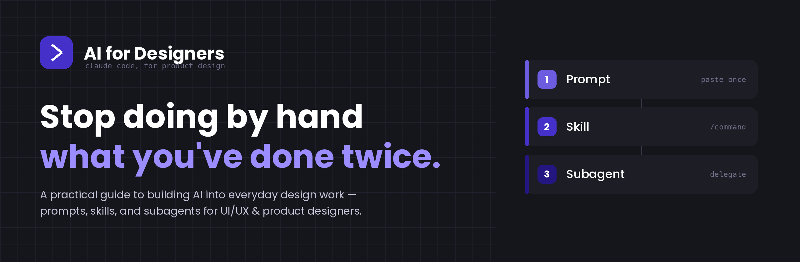
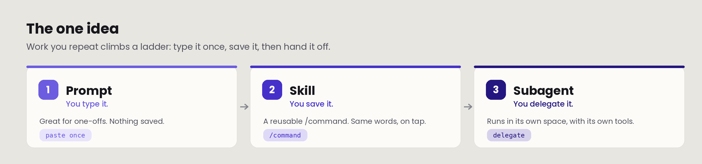
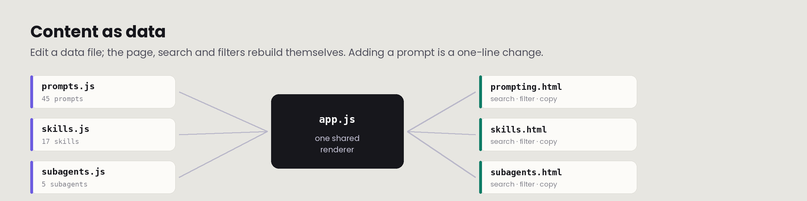

<p align="center">
  
</p>

<p align="center">
  <strong>A practical, production-ready guide to building AI into everyday design work.</strong><br>
  Not a prompt dump — a learning system organised around one idea: the <em>prompt &rarr; skill &rarr; subagent</em> ladder.
</p>

<p align="center">
  
  
  
  
  
  
</p>

---

## What this is

A guide for designers — anywhere from their first year to their fifteenth — who are good at the craft but haven't yet made AI a real part of how they work. It answers the question every designer new to AI keeps hitting: **when do I use a prompt, when a skill, and when an agent?**

Everything here is built for **Claude Code** specifically. Other tools come in a later version; this one earns its place first.

## The one idea

<p align="center">
  
</p>

Every technique in the guide is a rung on the same ladder. Work you repeat climbs it — from something you **type once**, to something you **save** as a `/command`, to something a **subagent runs on its own**. Knowing which rung a task belongs on is the single most useful thing this guide teaches.

## Pages

| Page | What it is |
|------|------------|
| **`index.html`** | Start Here — what this is, and a two-minute Claude Code on-ramp |
| **`foundations.html`** | The spine: the ladder, and where AI genuinely helps vs where it doesn't |
| **`prompting.html`** | Prompt library — 45 copy-ready prompts across 10 categories |
| **`skills.html`** | Skills library — user-invoked `/commands` + model-invoked standing rules |
| **`subagents.html`** | Subagents — delegated specialists, plus a note on agent teams |
| **`path.html`** | The 7-day guided path, from first prompt to first subagent |

## How it's built

<p align="center">
  
</p>

The libraries are **data, not markup**. Each prompt, skill and subagent is an object in a file under `assets/js/data/`. One shared renderer (`app.js`) builds the pages, search and filtering from that data — so **adding a prompt is a one-line change**, not HTML surgery. The installable `SKILL.md` and agent files are generated from the same definitions shown on the pages, so what you read is exactly what installs.

```
ai-for-designers/
├── index.html · foundations.html · prompting.html
├── skills.html · subagents.html · path.html
├── assets/
│   ├── css/tokens.css      design tokens — theme everything from one file
│   ├── css/base.css        shared layout + components
│   └── js/
│       ├── app.js          shared renderer (search / filter / copy)
│       └── data/           prompts.js · skills.js · subagents.js
├── skills/<name>/SKILL.md  installable skill files
├── agents/<name>.md        installable subagent files
├── docs/images/            README images (banner, ladder, architecture)
├── CLAUDE.md.template · LICENSE · README.md · .nojekyll
```

## Run locally

Open `index.html` in any browser. Everything is static — no build step, no dependencies beyond the Google-hosted webfonts.

## Deploy to GitHub Pages

1. Push this folder to a public repo (e.g. `ai-for-designers`).
2. **Settings &rarr; Pages &rarr; Source:** Deploy from a branch &rarr; `main` &rarr; `/ (root)` &rarr; **Save**.
3. Live at `https://<you>.github.io/<repo>/` in about a minute.
4. To update, edit a file and push — Pages redeploys automatically.

`.nojekyll` is included so Pages serves the files as-is. Prefer Vercel? Import the repo at [vercel.com](https://vercel.com) &rarr; **Add New &rarr; Project** &rarr; Deploy. No config needed for static HTML.

## Extend it

Adding to a library is a one-object edit — no HTML, no touching the page:

```js
// assets/js/data/prompts.js
{
  id:'ui-density', cat:'ui',
  title:'Audit information density',
  desc:'Find what to cut from a crowded screen.',
  when:'A screen feels busy and you cannot say why.',
  tags:['density','hierarchy','ui'],
  prompt:`You are a staff product designer. For the screen below...`
}
```

The page, its search index and its category filter rebuild themselves. Skills and subagents follow the same pattern in `skills.js` and `subagents.js`.

## Images in this README

Three images live in **`docs/images/`** — keep them there; the paths above are relative to the repo root:

| File | Used for |
|------|----------|
| `docs/images/banner.png` | Top hero banner |
| `docs/images/ladder.png` | The one-idea section |
| `docs/images/architecture.png` | The how-it's-built section |

To swap in your own, replace the files (keep the names) or update the `` paths.

## Credit

The user-invoked / model-invoked skill split is inspired by [mattpocock/skills](https://github.com/mattpocock/skills).

## License

[MIT](LICENSE) — add your name in the `LICENSE` file before publishing.
